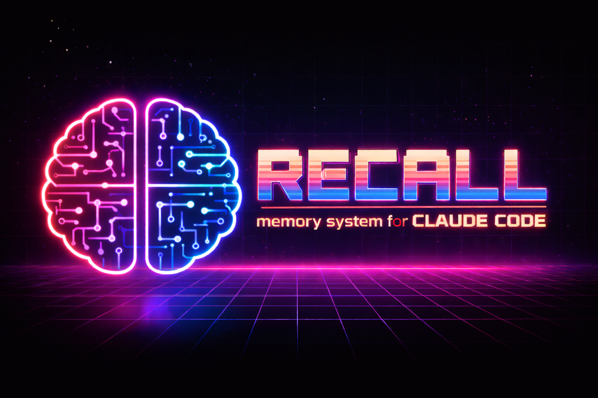

<p align="center">
  
</p>

<p align="center">
  <strong>A neuroscience-inspired persistent memory system for AI coding assistants</strong>
</p>

---

## The Problem

Every time you start a new Claude Code session, the slate is wiped clean. That architecture decision you made yesterday? Gone. The bug fix that took an hour to track down? Forgotten. The deployment workflow you refined over weeks? You'll explain it again.

AI assistants today have impressive reasoning but zero continuity. They're like a brilliant colleague with severe amnesia — capable in the moment, but unable to learn from experience.

## The Neuroscience Behind Recall

Human memory isn't a filing cabinet. It's a living, dynamic network — and that's exactly how Recall is built.

In the 1960s, Atkinson and Shiffrin proposed the **multi-store model**: sensory input flows through short-term (working) memory, and only the important parts get consolidated into long-term storage. Recall mirrors this with **session-scoped working memory** (Redis) that feeds into **persistent vector and graph storage** (Qdrant + Neo4j) through a consolidation pipeline.

Collins and Loftus' **spreading activation theory** (1975) describes how recalling one concept activates related concepts through weighted connections — thinking of "doctor" primes "nurse," "hospital," and "stethoscope." Recall implements this literally: when you search for a memory, activation propagates through the knowledge graph's weighted edges, surfacing contextually related memories that a simple keyword or vector search would miss.

The brain doesn't remember everything equally. The **amygdala** gates memory formation based on emotional significance — a production outage gets seared into memory while a routine `npm install` fades immediately. Recall's signal detector uses an LLM to score each memory's **poignancy** on a 1-10 scale (inspired by Stanford's Generative Agents research), so critical bug fixes score 0.9 while routine facts settle at 0.4.

Ebbinghaus' **forgetting curve** shows that memories decay exponentially without reinforcement, but each retrieval resets the curve. Recall applies the same principle: unused memories gradually lose importance, while accessed memories strengthen. Consolidated memories (those that survived merging with similar memories) develop higher **stability** — just like how human memories become more resilient through reconsolidation.

The result: an AI assistant that actually learns from experience. It remembers what matters, forgets what doesn't, and builds an ever-growing web of interconnected knowledge that gets smarter with every session.

## How It Works

```
You type a prompt
       |
       v
[recall-retrieve.js]  <-- Queries Recall automatically
  Returns top 5 relevant memories from past sessions
  Claude sees them as natural context
       |
       v
Claude works (edits files, writes code)
       |
       v
[observe-edit.js]  <-- Watches every file edit
  LLM extracts facts: ports, URLs, architecture decisions, bug fixes
  Stores them as memories automatically
       |
       v
Session ends
       |
       v
[recall-session-summary.js]  <-- Captures what happened
  Stores an episodic summary for next-session continuity
       |
       v
Next session --> recall-retrieve.js surfaces those memories
```

No configuration needed. No CLAUDE.md instructions. The hooks create a closed-loop memory system that works organically.

When context reaches 65%, the **statusline** automatically triggers a handoff — sending the transcript to your local LLM (Ollama) for summarization and storing it to Recall. Session knowledge survives auto-compact.

## Architecture

```
Claude Code Hooks (client-side)
    |-- UserPromptSubmit --> recall-retrieve.js (query memories)
    |-- PostToolUse      --> observe-edit.js (extract & store facts)
    |-- PostToolUse      --> lint-check.js (auto-fix code)
    |-- PostToolUse      --> context-monitor.js (track token usage)
    |-- Stop             --> recall-session-summary.js (store summary)
    |-- Stop             --> stop-guard.js (warn on uncommitted changes)
    |-- Stop             --> session-save.js (save session state)
    |
    v
FastAPI API (:8200)
    |-- /memory/*     CRUD + relationships + batch + pinning + anti-patterns + feedback
    |-- /search/*     browse (summaries) / full / timeline / context
    |-- /session/*    session lifecycle + working memory
    |-- /ingest/*     turn ingestion + signal detection
    |-- /observe/*    file-change observer (fact extraction)
    |-- /admin/*      export, import, reconcile, audit, sessions, ollama, users
    |-- /events/*     SSE stream for real-time dashboard
    |-- /health       public health check
    |-- /metrics      Prometheus format
    |-- /stats        system + domain statistics
    |-- /dashboard    React SPA
    |
    v
Storage Layer
    |-- Qdrant        vector store (memories + sub-embeddings/facts)
    |-- Neo4j         graph store (relationships, spreading activation)
    |-- Redis         volatile (sessions, working memory, turns, cache)
    |-- PostgreSQL    durable metadata (audit log, session archive, metrics)
    |
    v
ARQ Worker (background jobs)
    |-- Consolidation   hourly at :00 (merge similar memories)
    |-- Decay           every 30min at :15/:45 (forgetting curve)
    |-- Metrics         hourly at :30 (snapshot to Postgres)
    |-- Patterns        daily at 3:30am (extract recurring themes)
    |
    v
Ollama (local LLM inference)
    |-- qwen3:14b     signal detection, consolidation, fact extraction
    |-- qwen3-embedding:0.6b  embeddings (1024 dimensions)
```

## Core Features

### Memory Formation
| Mechanism | Inspiration | Implementation |
|-----------|-------------|----------------|
| **Signal Detection** | Selective attention — not everything becomes long-term memory | LLM analyzes conversations, extracts facts/decisions/bugs/workflows with confidence scores |
| **Poignancy Scoring** | Amygdala-gated encoding — emotional significance determines memory strength | 1-10 importance scale: production bugs score 8, routine facts score 4 |
| **Observer Hooks** | Incidental encoding — we remember things we weren't trying to learn | File edits are automatically analyzed for extractable facts |
| **Content-Hash Dedup** | Pattern separation — the hippocampus prevents overlapping memories | Identical content detected and deduplicated at store time |

### Memory Retrieval
| Mechanism | Inspiration | Implementation |
|-----------|-------------|----------------|
| **Spreading Activation** | Collins & Loftus (1975) — activation propagates through semantic networks | Graph traversal weighted by relationship strength: `activation *= edge_strength * decay` |
| **Multi-Stage Pipeline** | Reconstructive memory — recall is an active process, not playback | Vector search -> graph expansion -> context filtering -> ranking -> inhibition |
| **Interference/Inhibition** | Competing memories suppress each other | CONTRADICTS relationships penalize lower-scored memory (0.7x); exact duplicates removed |
| **Context-Dependent Retrieval** | Encoding specificity — recall is better when context matches | Session, file path, and task keywords boost matching memories |
| **Retrieval-Induced Strengthening** | Testing effect — retrieving a memory makes it stronger | Every access increments importance and resets the decay clock |

### Memory Dynamics
| Mechanism | Inspiration | Implementation |
|-----------|-------------|----------------|
| **Forgetting Curve** | Ebbinghaus (1885) — exponential decay without rehearsal | Importance decays every 30 minutes; unused memories fade |
| **Consolidation** | Sleep consolidation — the brain merges related memories overnight | Hourly LLM-powered merge of similar memories; increases stability |
| **Pattern Extraction** | Schema formation — episodes become generalized knowledge | Daily job finds recurring themes across episodic memories |
| **Stability** | Synaptic consolidation — older memories resist interference | Consolidated memories have higher stability, slower decay |
| **Memory Pinning** | Flashbulb memories — some memories are too important to forget | Pinned memories are immune to decay; architecture decisions persist forever |
| **Retrieval Feedback** | Testing effect — successful recall strengthens memory | Memories used in helpful responses gain importance; irrelevant ones fade faster |

### Adaptive Intelligence
| Mechanism | Inspiration | Implementation |
|-----------|-------------|----------------|
| **Anti-Patterns** | Amygdala danger memory — the brain prioritizes threats | Dedicated collection of "what NOT to do" warnings; injected into retrieval when relevant |
| **Feedback Loop** | Reinforcement learning — reward shapes future behavior | Session-end hook compares injected memories to assistant output via cosine similarity; adjusts importance/stability |
| **Pinning** | Long-term potentiation — repeatedly activated synapses become permanent | Pin endpoint marks memories as decay-immune; unpin restores normal decay |

### Storage Architecture
| Store | Role | Neuroscience Parallel |
|-------|------|----------------------|
| **Qdrant** (vector) | Semantic similarity, embedding search, sub-embeddings | Hippocampal index — fast pattern-matching retrieval |
| **Neo4j** (graph) | Relationships, traversal, spreading activation, contradiction tracking | Cortical networks — associative connections between concepts |
| **Redis** (volatile) | Sessions, working memory, turn buffer, cache | Working memory — temporary, capacity-limited, fast access |
| **PostgreSQL** (durable) | Audit log, session archive, metrics snapshots | Autobiographical record — what happened and when |

### Token-Efficient 3-Layer Search
Most memory systems dump full content into the context window. Recall is designed for token economy:

1. **Browse** (`POST /search/browse`) — Returns IDs + 120-char summaries. Scan dozens of memories for pennies.
2. **Get** (`GET /memory/{id}`) — Fetch full content only for the memories that matter.
3. **Timeline** (`POST /search/timeline`) — Chronological view for temporal context.

### Sub-Embeddings (Granular Fact Search)
A single memory about "deploying the auth service" might contain facts about Docker, nginx, JWT tokens, and port numbers. A standard embedding averages all of these, producing weak matches for any specific topic.

Recall breaks each memory into **atomic facts** at store time, embedding each one separately in a dedicated Qdrant collection. Search hits the precise fact, then returns the parent memory with a 1.15x score boost. This solves the "averaged embedding" problem that plagues every other memory system.

### React Dashboard
Full single-page app at `/dashboard` built with React + Vite + Tailwind + DaisyUI:
- **Memories** — Browse, search, bulk select/delete, detail modals, `stored_by` badges, user filter
- **Sessions** — Expandable cards with turn timelines
- **Signals** — Review pending auto-detected signals
- **Audit** — Full mutation history with relative timestamps
- **Users** — Create/list/delete users, one-time API key reveal
- **LLM** — Ollama model status, running models, RAM/VRAM usage
- **Settings** — Maintenance operations, theme toggle
- Real-time updates via Server-Sent Events
- Dark/light theme with collapsible sidebar

---

## Quick Start

### Prerequisites
- Docker & Docker Compose
- Ollama running somewhere on your network with `qwen3-embedding:0.6b` and `qwen3:14b` models
- Node.js (for Claude Code hooks and MCP server)

### Option 1: Deploy Script (Recommended)

**Linux/Mac/WSL:**
```bash
git clone https://github.com/Nerfherder16/Recall.git
cd Recall
chmod +x scripts/deploy.sh
./scripts/deploy.sh http://YOUR_OLLAMA_HOST:11434
```

**Windows PowerShell:**
```powershell
git clone https://github.com/Nerfherder16/Recall.git
cd Recall
.\scripts\deploy.ps1 -OllamaHost "http://YOUR_OLLAMA_HOST:11434"
```

The deploy script will:
1. Check Docker and Ollama prerequisites
2. Pull the `qwen3-embedding:0.6b` embedding model if missing
3. Create a `.env` configuration file
4. Build and start the full stack (6 containers)
5. Wait for health checks to pass
6. Warm up the embedding model

### Option 2: Manual

```bash
# Pull required models
ollama pull qwen3-embedding:0.6b
ollama pull qwen3:14b

# Edit docker-compose.yml to set your RECALL_OLLAMA_HOST
# Then start the stack
docker compose up -d

# Check health
curl http://localhost:8200/health
```

### Enable Authentication (Recommended)

By default, auth is disabled for easy development. To secure your instance:

```bash
# On your server, create a .env file with your API key
echo "RECALL_API_KEY=your-secret-key-here" >> /path/to/Recall/.env

# Restart the API to pick up the key
docker compose up -d api
```

Once enabled:
- All endpoints except `/health` require `Authorization: Bearer <key>`
- `/health` remains public for monitoring
- The startup log will show `auth_enabled=True`

**Multi-user support:** Create per-user API keys via `POST /admin/users`. Each user's memories are attributed with `stored_by` and can be filtered with the `user` search parameter. All users see all memories by default (shared visibility).

Generate a strong key:
```bash
python3 -c "import secrets; print(secrets.token_urlsafe(32))"
```

### First Memory

```bash
curl -X POST http://localhost:8200/memory/store \
  -H "Content-Type: application/json" \
  -d '{
    "content": "JWT tokens should use 24h expiry for this project",
    "memory_type": "semantic",
    "domain": "auth",
    "tags": ["jwt", "security"]
  }'
```

### Search

```bash
curl -X POST http://localhost:8200/search/browse \
  -H "Content-Type: application/json" \
  -d '{
    "query": "What is the token configuration?",
    "limit": 5
  }'
```

---

## Claude Code Integration (MCP Server + Hooks + Statusline)

Recall ships with an MCP server, organic memory hooks, and a context-aware statusline. The installer configures everything in one command.

### Quick Install

```bash
cd mcp-server && npm install && cd ..
node install.js
# Follow the prompt for your Recall host, or:
node install.js --host http://YOUR_SERVER:8200
```

This configures:
- **MCP Server** — `recall_*` tools in Claude Code
- **Hooks** — auto-retrieve, auto-store, session summaries
- **Statusline** — context usage bar with auto-handoff at 65%

To uninstall: `node install.js --uninstall`

### Manual Setup

If you prefer manual configuration, add to `~/.claude.json` under `mcpServers`:

```json
{
  "recall": {
    "command": "node",
    "args": ["/path/to/Recall/mcp-server/index.js"],
    "env": {
      "RECALL_HOST": "http://YOUR_SERVER:8200",
      "RECALL_API_KEY": "your-secret-key-here"
    }
  }
}
```

> **Note:** If auth is disabled (no `RECALL_API_KEY` set on the server), you can omit the `RECALL_API_KEY` env var.

Restart Claude Code. The `recall_*` tools will be available.

### MCP Tools

| Tool | Description |
|------|-------------|
| `recall_store` | Store a memory (semantic, episodic, or procedural) |
| `recall_search` | Browse memories — returns IDs + 120-char summaries (use `recall_get` for full details) |
| `recall_search_full` | Full-content search (backwards compat, returns complete memory content) |
| `recall_timeline` | Browse memories chronologically around a point in time |
| `recall_context` | Assemble formatted context for prompt injection |
| `recall_stats` | Get memory counts and system statistics |
| `recall_health` | Check health of all services |
| `recall_get` | Retrieve a specific memory by UUID |
| `recall_similar` | Find memories similar to a given one |
| `recall_ingest` | Ingest conversation turns for auto signal detection |

### Claude Code Hooks

All hooks are Node.js (CommonJS) scripts in `hooks/`. They run automatically — no CLAUDE.md configuration needed.

| Hook | Event | What It Does |
|------|-------|-------------|
| `recall-retrieve.js` | UserPromptSubmit | Queries Recall on every prompt, injects top 5 relevant memories as context |
| `observe-edit.js` | PostToolUse (Write/Edit) | Sends file changes to Recall for LLM fact extraction |
| `recall-session-summary.js` | Stop | Reads transcript, submits retrieval feedback, stores episodic session summary |
| `lint-check.js` | PostToolUse (Write/Edit) | Runs ruff (Python) / eslint (JS/TS), auto-fixes first |
| `context-monitor.js` | PostToolUse | Estimates token usage from transcript size, warns at 150K+ |
| `stop-guard.js` | Stop | Blocks stop if uncommitted git changes exist |
| `session-save.js` | Stop | Auto-saves session state to Recall |
| `recall-statusline.js` | Statusline | Context usage bar; at 65% triggers Ollama summary → stores handoff to Recall |

---

## API Reference

**Base URL:** `http://localhost:8200`

**Authentication:** If `RECALL_API_KEY` is set, all endpoints except `/health` require:
```
Authorization: Bearer <your-api-key>
```

### Memory Operations

#### `POST /memory/store`
Store a new memory. The content is embedded with Qwen3-Embedding and stored in both vector (Qdrant) and graph (Neo4j) storage.

**Request:**
```json
{
  "content": "The auth service uses bcrypt for password hashing",
  "memory_type": "semantic",
  "source": "user",
  "domain": "auth",
  "tags": ["security", "passwords"],
  "importance": 0.7,
  "confidence": 0.9,
  "session_id": null,
  "metadata": {}
}
```

| Field | Type | Default | Limits | Description |
|-------|------|---------|--------|-------------|
| `content` | string | *required* | 1-50,000 chars | The memory content |
| `memory_type` | enum | `semantic` | | `semantic`, `episodic`, or `procedural` |
| `source` | enum | `user` | | `user`, `system`, `observation`, `inference` |
| `domain` | string | `general` | max 200 chars | Project/topic domain for filtering |
| `tags` | string[] | `[]` | max 50 tags | Tags for categorization |
| `importance` | float | `0.5` | 0.0-1.0 | Higher = slower decay |
| `confidence` | float | `0.8` | 0.0-1.0 | Certainty of information |
| `session_id` | string? | `null` | | Links memory to a session's working memory |
| `metadata` | object | `{}` | | Arbitrary metadata |

**Response:**
```json
{
  "id": "uuid",
  "content_hash": "hex-hash",
  "created": true,
  "message": "Memory stored successfully"
}
```

Duplicate content (same content hash) returns `created: false` with the existing ID.

#### `GET /memory/{id}`
Get a memory by UUID.

#### `DELETE /memory/{id}`
Delete a memory from all stores.

#### `POST /memory/relationship`
Create a typed relationship between two memories.

**Request:**
```json
{
  "source_id": "uuid-1",
  "target_id": "uuid-2",
  "relationship_type": "related_to",
  "strength": 0.7,
  "bidirectional": false
}
```

Relationship types: `related_to`, `caused_by`, `solved_by`, `supersedes`, `derived_from`, `contradicts`, `requires`, `part_of`

#### `POST /memory/batch/store`
Store multiple memories in one request (max 50). Each item follows the same schema as `/memory/store`. Returns per-item results with created/duplicate/error counts.

#### `POST /memory/batch/delete`
Delete multiple memories by ID (max 100).

#### `POST /memory/{id}/pin`
Pin a memory — makes it immune to decay. Returns the updated memory with `pinned: true`.

#### `DELETE /memory/{id}/pin`
Unpin a memory — restores normal decay behavior.

#### `POST /memory/anti-pattern`
Create an anti-pattern (a "what NOT to do" warning). The pattern is embedded and stored in a dedicated collection. Matching anti-patterns are injected into search results automatically.

**Request:**
```json
{
  "pattern": "Using pickle to deserialize untrusted data",
  "warning": "Allows arbitrary code execution",
  "alternative": "Use JSON or MessagePack instead",
  "severity": "error",
  "domain": "python",
  "tags": ["security"]
}
```

#### `GET /memory/anti-patterns`
List all anti-patterns. Optional query param: `domain` to filter.

#### `GET /memory/anti-pattern/{id}`
Get a single anti-pattern by ID.

#### `DELETE /memory/anti-pattern/{id}`
Delete an anti-pattern.

#### `POST /memory/feedback`
Submit retrieval feedback. Compares injected memory embeddings against the assistant's output text via cosine similarity. Memories that contributed to useful output gain importance; irrelevant ones lose it.

**Request:**
```json
{
  "injected_ids": ["uuid-1", "uuid-2"],
  "assistant_text": "The assistant's response text (min 50 chars)..."
}
```

**Response:**
```json
{
  "processed": 2,
  "useful": 1,
  "not_useful": 1,
  "not_found": 0
}
```

#### `GET /memory/{id}/related`
Get memories connected via graph traversal.

Query params: `max_depth` (1-10, default 2), `limit` (1-100, default 10)

### Search & Retrieval

#### `POST /search/browse`
Token-efficient search — returns IDs and 120-char summaries instead of full content. Use `GET /memory/{id}` to fetch full details for interesting results.

**Request:**
```json
{
  "query": "How does the auth system work?",
  "domains": ["auth"],
  "memory_types": ["semantic"],
  "tags": [],
  "min_importance": 0.0,
  "limit": 10
}
```

#### `POST /search/timeline`
Chronological view of memories around an anchor point. If no `anchor_id`, returns most recent entries.

#### `POST /search/query`
Full retrieval pipeline: vector similarity -> spreading activation -> context filtering -> ranking -> inhibition.

#### `POST /search/context`
Assemble formatted context for injection into prompts. Groups memories by type under markdown headers.

#### `GET /search/similar/{id}?limit=5`
Find memories semantically similar to a given memory.

### Conversation Ingestion (Signal Detection)

#### `POST /ingest/turns`
Ingest conversation turns for automatic signal detection. The LLM analyzes turns in the background and auto-stores important signals as memories.

**Request:**
```json
{
  "session_id": "uuid",
  "turns": [
    {"role": "user", "content": "How do I fix Docker permissions?"},
    {"role": "assistant", "content": "Run: sudo chmod 666 /var/run/docker.sock"}
  ]
}
```

| Field | Limits |
|-------|--------|
| `turns` | 1-50 per request |
| `turn.content` | 1-50,000 chars |
| `turn.role` | max 20 chars |

Signal confidence thresholds:
- **>= 0.75**: Auto-stored as memory
- **0.4 - 0.75**: Added to pending queue for review
- **< 0.4**: Discarded

#### `GET /ingest/{session_id}/signals` - Pending signals awaiting review
#### `POST /ingest/{session_id}/signals/approve` - Approve a pending signal
#### `GET /ingest/{session_id}/turns` - Get stored turns for a session

### Observer

#### `POST /observe/file-change`
Observe a code edit for automatic fact extraction. Returns immediately; processing happens in the background.

#### `POST /observe/session-snapshot`
Capture a session snapshot as a memory.

### Sessions

#### `POST /session/start` - Start a new session
#### `POST /session/end` - End session (optionally trigger consolidation)
#### `GET /session/{id}` - Session status
#### `GET /session/{id}/working-memory` - Working memory contents
#### `POST /session/{id}/context` - Update session context

### Admin

#### `POST /admin/consolidate` - Trigger memory consolidation on-demand
#### `POST /admin/decay` - Trigger importance decay on-demand
#### `GET /admin/export` - Export all memories as streaming JSONL
#### `POST /admin/import` - Import memories from `.jsonl` file upload
#### `POST /admin/reconcile` - Detect/repair Qdrant-Neo4j inconsistencies
#### `GET /admin/audit` - Query PostgreSQL audit log
#### `GET /admin/sessions` - Archived session history
#### `GET /admin/ollama` - Ollama model status and resource usage
#### `POST /admin/users` - Create a user (returns one-time API key with `rc_` prefix)
#### `GET /admin/users` - List all users (without API keys)
#### `DELETE /admin/users/{id}` - Delete a user (memories remain)

### System

#### `GET /health` - Service health (always public, no auth)
#### `GET /stats` - Memory counts, graph stats, active sessions
#### `GET /stats/domains` - Per-domain count and average importance
#### `GET /metrics` - Prometheus-format metrics
#### `GET /events/stream` - SSE stream for real-time dashboard updates
#### `GET /dashboard` - React SPA dashboard

---

## Docker Services

| Container | Image | Port | Purpose |
|-----------|-------|------|---------|
| `recall-api` | Built from Dockerfile (multi-stage: Node.js + Python) | 8200 | FastAPI application + React dashboard |
| `recall-worker` | Built from Dockerfile | - | ARQ background tasks |
| `recall-qdrant` | qdrant/qdrant | 6333, 6334 | Vector storage |
| `recall-neo4j` | neo4j:5-community | 7575, 7688 | Graph storage |
| `recall-postgres` | postgres:16-alpine | 5433 | Audit log, session archive, metrics snapshots |
| `recall-redis` | redis:7-alpine | 6380 | Cache, sessions, working memory |

All storage ports are bound to `127.0.0.1` only (not exposed to network).

---

## Configuration

All configuration is via environment variables (prefix `RECALL_`):

| Variable | Default | Description |
|----------|---------|-------------|
| `RECALL_ENV` | `development` | Environment mode |
| `RECALL_API_KEY` | *(empty)* | API key for bearer auth (empty = auth disabled) |
| `RECALL_ALLOWED_ORIGINS` | `*` | Comma-separated CORS origins |
| `RECALL_OLLAMA_HOST` | `http://localhost:11434` | Ollama API endpoint |
| `RECALL_EMBEDDING_MODEL` | `qwen3-embedding:0.6b` | Ollama embedding model |
| `RECALL_EMBEDDING_DIMS` | `1024` | Embedding dimensions |
| `RECALL_SIGNAL_DETECTION_MODEL` | `qwen3:14b` | LLM for signal detection |
| `RECALL_SIGNAL_CONFIDENCE_AUTO_STORE` | `0.75` | Auto-store threshold |
| `RECALL_SIGNAL_CONFIDENCE_PENDING` | `0.4` | Pending queue threshold |
| `RECALL_MAX_CONTENT_LENGTH` | `50000` | Max chars for content fields |
| `RECALL_MAX_TURNS_PER_REQUEST` | `50` | Max turns per ingest request |
| `RECALL_QDRANT_HOST` | `qdrant` | Qdrant hostname |
| `RECALL_QDRANT_PORT` | `6333` | Qdrant port |
| `RECALL_NEO4J_URI` | `bolt://neo4j:7687` | Neo4j connection |
| `RECALL_NEO4J_USER` | `neo4j` | Neo4j username |
| `RECALL_NEO4J_PASSWORD` | `recallmemory` | Neo4j password |
| `RECALL_REDIS_URL` | `redis://redis:6379` | Redis connection |
| `RECALL_POSTGRES_DSN` | *(see docker-compose)* | PostgreSQL DSN |
| `RECALL_RATE_LIMIT_DEFAULT` | `60/minute` | Default rate limit |
| `RECALL_RATE_LIMIT_SEARCH` | `30/minute` | Search endpoint limit |
| `RECALL_RATE_LIMIT_INGEST` | `20/minute` | Ingest endpoint limit |
| `RECALL_RATE_LIMIT_ADMIN` | `10/minute` | Admin endpoint limit |

---

## Memory Types

| Type | Use For | Examples |
|------|---------|---------|
| **semantic** | Facts, concepts, relationships | "The API uses JWT auth with 24h expiry" |
| **episodic** | Events, experiences, sessions | "Fixed the UUID collision bug on 2026-02-14" |
| **procedural** | How-to, workflows, processes | "To deploy: run tests, build container, push to registry" |

---

## Development

### Install dependencies
```bash
pip install -e ".[dev]"
```

### Run API locally
```bash
uvicorn src.api.main:app --reload --port 8200
```

### Run worker locally
```bash
arq src.workers.main.WorkerSettings
```

### Run tests
```bash
# All tests (requires live API — set RECALL_API_URL env var or default http://localhost:8200)
pytest tests/integration/ -v

# Fast tests only (no LLM calls)
pytest tests/integration/ -v -m "not slow"

# Slow tests (signal detection, consolidation — requires Ollama)
pytest tests/integration/ -v -m "slow"
```

### Dashboard development
```bash
cd dashboard
npm install
npm run dev    # Vite dev server with API proxy
npm run build  # Build to src/api/static/dashboard/
```

### Deploy changes without rebuild
Source code is volume-mounted (`./src:/app/src`), so:
```bash
docker compose restart api worker
```

### Simulation Testbed

A comprehensive stress test and quality measurement framework. Run against your live API to benchmark performance and catch regressions.

```bash
# Full run (all 6 suites, ~15min)
python -m tests.simulation.testbed

# Individual suites
python -m tests.simulation.testbed --suites lifecycle        # Decay, reinforcement, consolidation
python -m tests.simulation.testbed --suites retrieval        # Precision/recall/MRR, graph expansion
python -m tests.simulation.testbed --suites stress           # Concurrent load, dedup, throughput
python -m tests.simulation.testbed --suites signals          # Signal detection quality (requires Ollama)
python -m tests.simulation.testbed --suites time_accel       # 28-day lifecycle simulation
python -m tests.simulation.testbed --suites adaptive         # Pinning, anti-patterns, feedback loop

# Compare two runs
python -m tests.simulation.testbed --compare reports/run-A.json reports/run-B.json

# Clean up a previous run's data
python -m tests.simulation.testbed --cleanup-only <run_id>
```

Each run produces a timestamped JSON report in `tests/simulation/reports/` with per-suite metrics, latency percentiles, and observations. Use `--compare` to diff two reports side by side.

| Suite | What It Measures | Duration |
|-------|-----------------|----------|
| **lifecycle** | Decay curves, reinforcement delta, consolidation merge rate | ~2min |
| **retrieval** | Precision@K, recall, MRR, negative precision, graph expansion, inhibition | ~3min |
| **stress** | Concurrent store/search throughput, dedup under concurrency, batch + load | ~20s |
| **signals** | Detection rate, auto-store vs pending, type match rate, confidence distribution | ~3min |
| **time_accel** | 28-day simulation: survival curve, population dynamics, consolidation frequency | ~5min |
| **adaptive** | Memory pinning (decay immunity), anti-pattern CRUD + retrieval, feedback loop | ~40s |

Suites use domain isolation (`testbed-{suite}-{run_id}`) and automatic cleanup so production data is unaffected.

---

## Operational Features

- **Rate limiting** — per-IP throttling (slowapi): 60/min default, 30/min search, 20/min ingest, 10/min admin
- **Batch operations** — store up to 50 or delete up to 100 memories in a single call
- **Date-range search** — filter by `since`/`until` timestamps
- **Prometheus metrics** — `/metrics` endpoint for monitoring
- **JSONL export/import** — full data portability with streaming export
- **Reconcile** — detect and repair Qdrant/Neo4j inconsistencies
- **Audit log** — every mutation logged to PostgreSQL
- **Graceful degradation** — API returns 503 when Ollama is down; workers skip and retry
- **Bearer token auth** — master key via `RECALL_API_KEY` + per-user keys via admin API
- **Multi-user support** — per-user API keys with `rc_` prefix, `stored_by` attribution, user filter on search
- **Context-aware handoff** — statusline monitors usage %, auto-summarizes via Ollama at 65% (before auto-compact), stores to Recall
- **Error sanitization** — internal details never leaked to clients
- **Input validation** — content length, turn count, and field size limits
- **Configurable CORS** — restrict origins via `RECALL_ALLOWED_ORIGINS`

---

## Data Consistency

Recall uses dual-write to Qdrant (vectors) and Neo4j (graph). On Neo4j write failure, a compensating delete removes the Qdrant record to prevent orphaned data. This applies to all write paths: store, consolidation merge, signal auto-store, signal approval, and pattern extraction.

Superseded memories (merged during consolidation) are marked in both stores and filtered from graph traversal queries.

---

## Project Status

Active development through 14 phases of iterative refinement:

- [x] Core API (store, search, context, sessions)
- [x] Vector storage (Qdrant) with content-hash deduplication
- [x] Graph storage (Neo4j) with parameterized Cypher queries
- [x] Cache & sessions (Redis) with SCAN-based counting
- [x] Background workers (decay, consolidation, patterns)
- [x] Signal detection brain (auto-memory from conversations)
- [x] Docker Compose deployment with deploy scripts
- [x] MCP server for Claude Code
- [x] Integration tests (157 tests: 138 fast + 29 slow/LLM)
- [x] Security (auth, error sanitization, input validation, CORS)
- [x] LLM-powered consolidation and pattern extraction
- [x] PostgreSQL audit log & session archive
- [x] Prometheus metrics & JSONL export/import
- [x] Rate limiting & batch operations
- [x] 3-layer token-efficient search (browse + timeline)
- [x] Sub-embeddings (granular fact search)
- [x] Observer hooks (auto-memory from code edits)
- [x] React SPA dashboard (6 views, SSE real-time, dark/light theme)
- [x] Organic memory loop (auto-retrieve on prompt, session summaries)
- [x] Spreading activation (Collins & Loftus graph traversal)
- [x] Interference/inhibition (contradiction suppression, deduplication)
- [x] LLM-scored poignancy (Stanford Generative Agents inspired importance)
- [x] Multi-user support (per-user API keys, user attribution, shared visibility)
- [x] One-command installer (`node install.js` — MCP + hooks + statusline)
- [x] Context-aware handoff (statusline monitors %, Ollama summarizes at 65%)
- [x] Memory pinning (decay-immune memories for architecture decisions)
- [x] Anti-pattern system (dedicated "what NOT to do" warnings, auto-injected into retrieval)
- [x] Retrieval feedback loop (session-end hook evaluates which memories were useful, adjusts importance)
- [x] Simulation testbed (6 suites: lifecycle, retrieval, stress, signals, time acceleration, adaptive)
- [ ] Scheduled backups

## License

MIT
